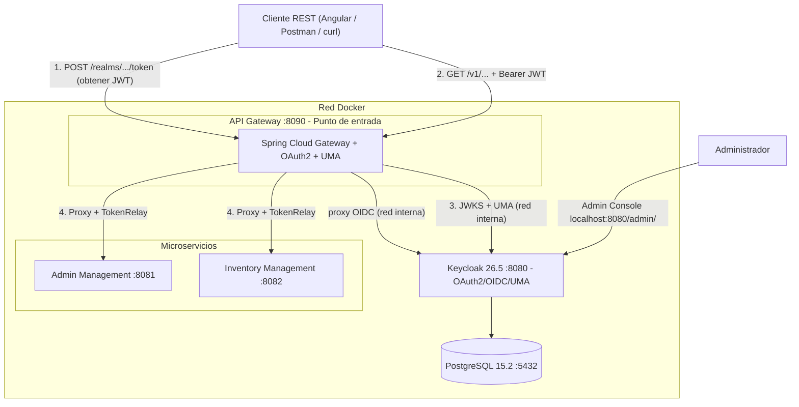

# restaurant-api


## Descripción del Proyecto

Plantilla de arquitectura de microservicios con autenticación y autorización centralizada usando Keycloak UMA (User Managed Access). El proyecto incluye un API Gateway que valida tokens JWT y verifica permisos por recurso antes de enrutar las peticiones a los microservicios de negocio.

Diseñado como base reutilizable para sistemas que requieren control de acceso granular (por recurso y operación) sin acoplar la lógica de seguridad a cada microservicio.

## Arquitectura



## Flujo de Autenticación y Autorización

1. **Obtener token**: El cliente hace `POST localhost:8090/realms/{realm}/protocol/openid-connect/token`. El gateway proxea la request a Keycloak internamente y devuelve el JWT. El cliente solo necesita conocer `localhost:8090`.
2. **Llamada a la API**: El cliente incluye el token como `Authorization: Bearer <token>` en cada request al gateway (`localhost:8090`).
3. **Validación en el gateway**:
   - Spring Security valida la firma del JWT descargando las claves públicas desde el endpoint JWKS interno de Keycloak.
   - El filtro UMA verifica si el token tiene permiso sobre el recurso y la operación solicitada (`{recurso}#{create|read|update}`).
4. **Proxy al microservicio**: Si el token es válido y el permiso existe, el gateway reenvía la request con `TokenRelay`.

## Componentes

| Componente | Puerto | Descripción |
|---|---|---|
| **API Gateway** | `8090` | Punto de entrada único. Valida JWT, verifica permisos UMA y enruta al microservicio correspondiente. |
| **Admin Management** | `8081` | Gestión de usuarios del sistema (meseros, administradores). |
| **Inventory Management** | `8082` | Gestión de ingredientes e inventario. CRUD completo. |
| **Keycloak** | `8080` (interno) | Plataforma de identidad. Endpoints OIDC accesibles vía gateway (`localhost:8090/realms/**`). Admin console en `localhost:8080/admin/`. |
| **PostgreSQL** | `5432` | Base de datos compartida por Keycloak y los microservicios. |

## Stack Tecnológico

| Categoría | Tecnología |
|---|---|
| Lenguaje | Java 25 |
| Framework | Spring Boot 3.5, Spring Cloud 2025, Spring WebFlux |
| Gateway | Spring Cloud Gateway (WebFlux) |
| Seguridad | Spring Security OAuth2, Keycloak UMA |
| Persistencia | PostgreSQL 15.2, Spring Data R2DBC |
| Documentación | OpenAPI 3.0, Swagger UI |
| Build | Maven (multi-módulo) |
| Contenedores | Docker, Docker Compose |

## Requisitos Previos

- Java 25+
- Maven 3.6+ (o usar el wrapper `./mvnw` incluido)
- Docker y Docker Compose

## Cómo Ejecutar (Local)

### 1. Clonar el repositorio

```bash
git clone https://github.com/RuddyQuispe/demo-keycloak-microservice.git
cd demo-keycloak-microservice
```

### 2. Compilar el proyecto

Desde la raíz del repositorio (compila los tres módulos en un solo paso):

```bash
./mvnw clean package -DskipTests
```

### 3. Construir las imágenes Docker

```bash
sh buildDocker.sh
```

Esto genera tres imágenes locales:
- `restaurant-api/admin-management:0.0.1-test`
- `restaurant-api/inventory-management:0.0.1-test`
- `restaurant-api/api-gateway:0.0.1-test`

### 4. Levantar el stack

```bash
docker compose -f docker-compose-dev.yaml up
```

Servicios disponibles:

| URL | Descripción |
|---|---|
| `http://localhost:8090` | API Gateway — único punto de entrada del cliente |
| `http://localhost:8090/realms/api-gateway-realm/...` | Endpoints OIDC de Keycloak (via gateway) |
| `http://localhost:8080/admin/` | Keycloak Admin Console (acceso directo) |
| `http://localhost:8081` | Admin Management (directo, sin gateway) |
| `http://localhost:8082` | Inventory Management (directo, sin gateway) |

### 5. Configurar Keycloak

Accedé al admin console en `http://localhost:8080/admin/` con las credenciales:
- **Usuario**: `admin`
- **Contraseña**: `admin`

Configuración mínima requerida:
1. Crear el realm `api-gateway-realm`
2. Crear el cliente `api-gateway-client` con Authorization habilitada
3. Definir los recursos (ej. `ingredient`, `user`) con sus scopes (`create`, `read`, `update`)
4. Crear políticas y permisos asociando roles a los recursos

> El permission format que usa el filtro UMA es `{nombre_recurso}#{scope}`, donde el nombre del recurso se extrae del path `/v1/{servicio}/{recurso}/...`.

## Pruebas con Postman

Importar la colección `keycloack-springboot.postman_collection.json` en Postman y configurar las siguientes variables de entorno:

| Variable | Valor (dev local) | Descripción |
|---|---|---|
| `HOST_KEYCLOACK` | `http://localhost:8090` | URL base para auth (vía gateway) |
| `API_GATEWAY_HOST` | `http://localhost:8090` | URL del gateway |
| `KEYCLOACK_REALM_ID` | `api-gateway-realm` | Nombre del realm |
| `KEYCLOACK_CLIENT_ID` | `api-gateway-client` | ID del cliente |
| `KEYCLOACK_KEY_SECRET` | *(del admin console)* | Client secret de Keycloak |
| `KEYCLOACK_BEARER_TOKEN` | *(del request login)* | JWT obtenido en el login |

**Flujo sugerido**:
1. Ejecutar `keycloack management > login user by realm` para obtener el JWT.
2. Copiar el `access_token` en `KEYCLOACK_BEARER_TOKEN`.
3. Ejecutar los requests de `inventory management` o `admin management`.

## Variables de Entorno

La única variable que cambia por ambiente es `KEYCLOAK_PUBLIC_URL`. Controla simultáneamente el issuer que Keycloak incluye en los tokens (`KC_HOSTNAME`) y la URL que el gateway usa para validar el claim `iss`.

| Variable | Dev local | Producción |
|---|---|---|
| `KEYCLOAK_PUBLIC_URL` | `http://localhost:8090` | `https://api.tu-dominio.com` |

Las demás variables en `docker-compose-dev.yaml` son defaults que no requieren cambio para desarrollo local.
